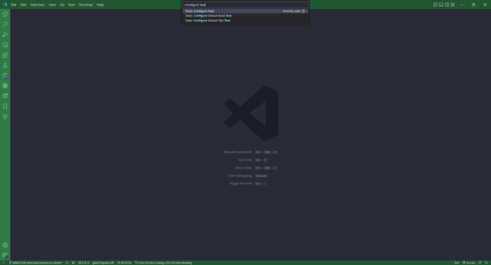
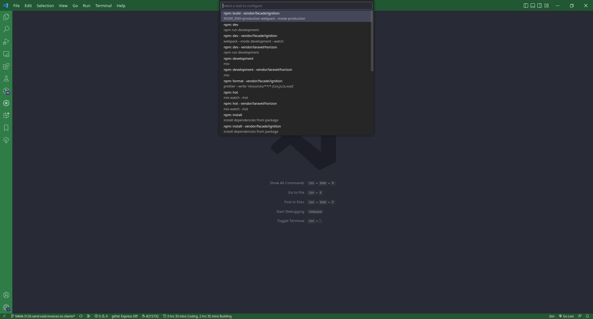

# Automate development process with vscode task

Hello artisans! In this tutorial we are going to learn how we can automate our development process using vscode tasks.

Wouldn't it be nice, if we were just open our project in Visual Studio Code (In short `vscode`) and voila! All the commands that are necessary to run the back-end and front-end instances (or server) are running for you automatically. 

With this goal in mind, let's __automate development__ today.

-----------

__Follow these steps__:

- Press `<Ctrl-Shift-p>`
- Type: ___Configure Tasks___ and hit enter



- Select any of the listed task and press enter



It will create a new `tasks.json` file for you under ___.vscode___ folder in your project.

## Sample `tasks.json` file is following:

```json
{
    "version": "2.0.0",
    "tasks": [
        {
            "label": "echo",
            "type": "shell",
            "command": "echo Hello"
        },
        {
            "label": "php-server",
            "type": "shell",
            "command": "php artisan serve --host=0.0.0.0 --port=9998",
            "group": {
                "kind": "build",
                "isDefault": true
            },
            "dependsOn": ["launch-chrome"],
            "runOptions": {
                "runOn": "folderOpen"
            },
            "presentation": {
                "echo": true,
                "reveal": "always",
                "focus": false,
                "panel": "shared",
                "showReuseMessage": true,
                "clear": false
            }
        },
        {
            "label": "npm-watch",
            "group": {
                "kind": "build",
                "isDefault": true
            },
            "type": "shell",
            "command": "npm run watch",
            "runOptions": {
                "runOn": "folderOpen"
            },
            "presentation": {
                "echo": true,
                "reveal": "always",
                "focus": false,
                "panel": "shared",
                "showReuseMessage": true,
                "clear": false
            }
        },
        {
            "label": "job-queue",
            "group": {
                "kind": "build",
                "isDefault": true
            },
            "type": "shell",
            "command": "php artisan horizon",
            "runOptions": {
                "runOn": "folderOpen"
            },
            "presentation": {
                "echo": true,
                "reveal": "always",
                "focus": false,
                "panel": "shared",
                "showReuseMessage": true,
                "clear": false
            }
        },
        {
            "label": "node-server",
            "group": {
                "kind": "build",
                "isDefault": true
            },
            "type": "shell",
            "command": "node nodejs/server.js",
            "runOptions": {
                "runOn": "folderOpen"
            },
            "presentation": {
                "echo": true,
                "reveal": "always",
                "focus": false,
                "panel": "shared",
                "showReuseMessage": true,
                "clear": false
            }
        },
        {
            "label": "launch-chrome",
            "type": "shell",
            "command": "/opt/google/chrome/chrome http://tenant360.nava.test:9998",
            "runOptions": {
                "runOn": "folderOpen"
            }
        }
    ]
}
```

Download [sample tasks.json file](https://gitlab.com/-/snippets/2473609)

All the magic happens with this one property ['runOptions'](https://code.visualstudio.com/docs/editor/tasks#_run-behavior).

- Configure your desired commands, to run as soon as the folder is opened in the work-space by adding the ‘runOn: folderOpen’ property.
- In our case 'php artisan serve' will start the php development server as soon as the folder opened in the work-space.

With all the configuration in place, from now onwards, whenever you open your VS code work-space, you should have your back-end server running on the specified port you automatically. Also it will run the build command, horizon for watching jobs, running node server etc. It wil also open your project server on chrome.

Hope you extend such use cases to automate your everyday development process & cherish the real power of VS code.


